# Iris Referral Matching

Indiana DCS sends Iris service referrals as **Kidtraks notification emails** — there is no
inbound API. Staff read each email, open the Kidtraks portal, work out who is qualified and
has capacity, get supervisor approval, and re-key the result into CaseWind.

This project automates that triage, matching, and approval loop — and is explicit about the
parts that **cannot** be computed from the data Iris actually has.

- 🎥 **Demo recording:** https://youtu.be/rIpICiwQYQY
- 💼 **Project write-up on LinkedIn:** https://www.linkedin.com/feed/update/urn:li:activity:7492650774108479488/

## How it works

```mermaid
graph LR
    Mailpit["📧 Kidtraks emails<br/>(Mailpit)"] --> Parser["Parser<br/>email → Referral"]
    Parser --> Engine["evaluate()<br/>scores every staff member"]
    Engine --> Planner["plan()<br/>allocates the whole queue"]
    Planner --> CaseDoc["Case Y.Doc<br/>proposal · offline-capable"]
    CaseDoc --> Api["Assignment API<br/>gate re-check + capacity txn"]
    Api --> Sqlite["SQLite<br/>reference + projections"]

    classDef pure fill:#e8f4ea,stroke:#3a7d44,color:#123
    classDef auth fill:#fdecea,stroke:#c92a2a,color:#123
    class Parser,Engine,Planner pure
    class Api auth
```



Three decisions shape everything else:

1. **Plan the set, not the referral.** Capacity is a shared budget, so the planner allocates
   across the entire pending queue, scarcity-first.
2. **Evaluate, then allocate.** `evaluate()` scores *every* staff member with a
   human-readable reason per gate and elects nobody; `plan()` selects. Blocked candidates
   stay visible, so "why not her?" always has an answer.
3. **Propose in the CRDT, commit through the API.** Planning is collaborative and works
   offline; the one act that spends a scarce slot is server-authoritative. *Plan anywhere,
   commit connected.*

Full rationale, data model, commit protocol, and client architecture:
**[docs/ARCHITECTURE.md](docs/ARCHITECTURE.md)**.

## Quick start

```bash
git submodule update --init   # vendored YORM (no npm release)
pnpm install
pnpm run yorm:build           # compile the vendored YORM packages — @yorm/* won't resolve until this runs
pnpm run mailpit              # Mailpit — SMTP :1025, UI :8025
pnpm run db:import            # roster + service matrix → SQLite
pnpm run seed                 # deliver the 30 referral emails
pnpm run dev                  # Vite client + Hono server
```

Then open http://localhost:5173 (the demo inbox is at http://localhost:8025).

| Command | Purpose |
|---|---|
| `pnpm run yorm:build` | Compile the vendored YORM packages (needed once after cloning) |
| `pnpm test` | Vitest unit and scenario suites |
| `pnpm run test:e2e` | Playwright phone-viewport journey |
| `pnpm run typecheck` | TypeScript, no emit |
| `pnpm run seed:fresh` | Reset Mailpit and re-deliver the emails |

## Repository map

| Path | What it is |
|---|---|
| [docs/ARCHITECTURE.md](docs/ARCHITECTURE.md) | Design of record — read this first |
| [approval_rules.md](approval_rules.md) | Authoritative business rules (wins over plan.md) |
| [flow.md](flow.md) | The manual process today vs what we automate |
| [plan.md](plan.md) | Build sequence and milestone checklists |
| [research/](research/) | Why there is no referral API to integrate with |
| [chats/](chats/) | Verbatim AI pairing transcripts — [chat0.md](chats/chat0.md) (KidTraks research write-up) and [chat1.md](chats/chat1.md) (milestones 0–7 build) |
| [src/](src/) | Ingest → parse → evaluate → plan pipeline, Hono server, React client |
| [staff_roster.csv](staff_roster.csv), [service_role_matrix.csv](service_role_matrix.csv), [referral_emails.json](referral_emails.json) | The data pack |

## What we cannot compute

Stated in the product, not hidden: the **20-hour capacity rule** is not reportable from
CaseWind, so the 12-family cap is the only measurable hard gate; the response deadline is a
config value because sources conflict; and real Kidtraks notifications are thinner than the
synthetic pack. See [the full list](docs/ARCHITECTURE.md#what-we-cannot-compute).

Staff names and referral contents are synthetic. **The service list, role tiers, and capacity
rules are Iris's own.**
