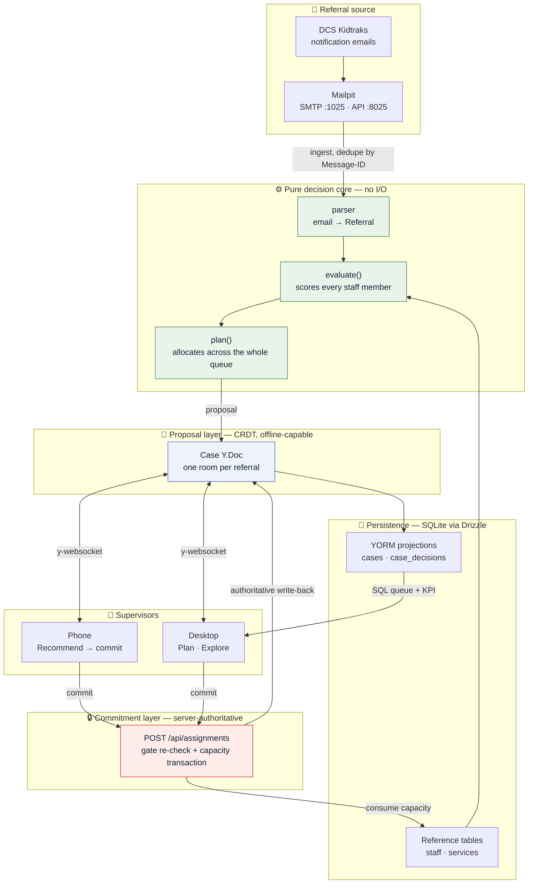
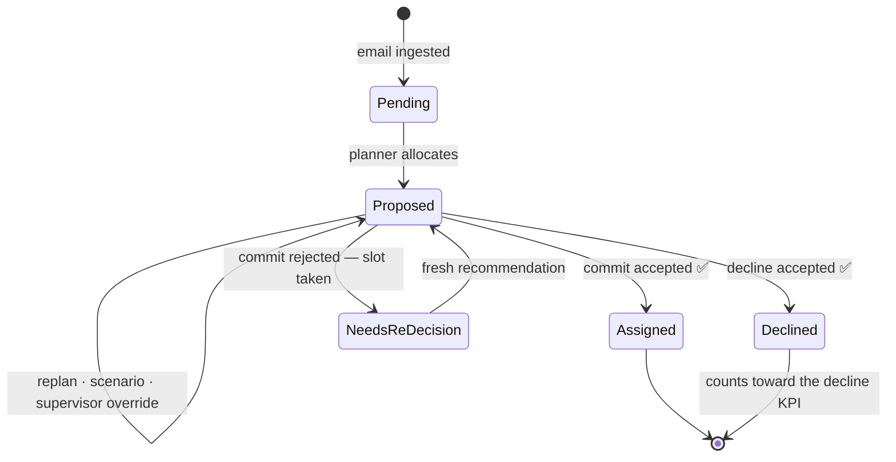
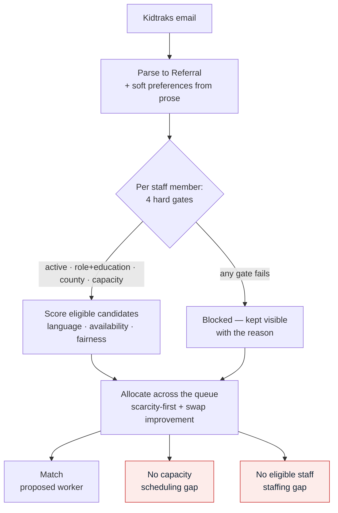
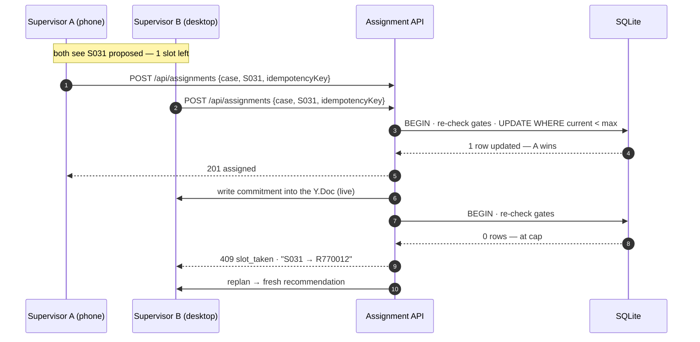

# Architecture

The design of record for Iris Referral Matching. This is the single source of truth for
the technical stack, system structure, data model, and the decisions that shape them.

- Build sequence and milestone checklists: [plan.md](../plan.md)
- Authoritative business rules: [approval_rules.md](../approval_rules.md)
- Today's manual process and what we automate: [flow.md](../flow.md)
- Why there is no referral API to integrate with: [research/Indiana_DCS_KidTraks_Integration.md](../research/Indiana_DCS_KidTraks_Integration.md)
 
## The problem in one paragraph

Indiana DCS sends Iris service referrals as **Kidtraks notification emails**. There is no
inbound API to receive them. Staff read each email, open the Kidtraks portal, work out who
is qualified and has capacity, get supervisor approval, and re-key the result into CaseWind.
This system automates the triage, matching, and approval loop — and is explicit about the
parts that cannot be computed from the data Iris actually has.

## System overview



## Three load-bearing decisions

Everything else follows from these.

### 1. Plan the set, not the referral

Staff capacity is a **shared budget**. Two Whitley-county FCT referrals cannot both take the
one clinician with a single slot left. Deciding referrals independently — or in arrival
order — hands that slot to whoever emailed first and reports a false "no capacity" for the
other, which corrupts the decline KPI by logging a scheduling gap as a staffing gap.

The planner therefore allocates across the whole pending queue, ordered by **scarcity**: a
referral with one possible worker is placed before a referral with ten.

### 2. Evaluate, then allocate

`evaluate()` returns the complete assessment of **every** staff member — per-gate pass/fail
with a human-readable reason, plus score components. It elects nobody. Selection happens in
`plan()`.

This is what keeps decision logic out of the UI. "Why not her?" and "what if I relax this?"
are answered from the same object that produced the recommendation, so no screen ever
re-derives a gate. Candidates are never filtered out server-side to tidy a response.

### 3. Propose in the CRDT, commit through the API

A CRDT gives **convergence, not invariants**. Two supervisors can both write "assign S031"
offline and those updates merge perfectly — while silently breaching the 12-family cap,
because neither write is individually invalid. There is no conflict for Yjs to detect.

So the system splits cleanly:

| | **Proposal** | **Commitment** |
|---|---|---|
| Lives in | the case Y.Doc | the server, via the assignment API |
| Consumes capacity | no | **yes** |
| Works offline | yes | no — needs real-time confirmation |
| Concurrent writes | merge | serialized; one wins, the other is told why |
| Reversible | freely, replanned any time | only by explicit unassign |

Exploring, ranking, scenario-testing, note-taking and *proposing* are collaborative and
offline-capable. The single act that spends a scarce slot is server-authoritative.

## Technical stack

| Layer | Choice | Why |
|---|---|---|
| UI | **React + Vite + TypeScript** | Required by `@mieweb/ui` and `@esheet/*` |
| Components | **[@mieweb/ui](https://github.com/mieweb/ui)** | House component library; `--mieweb-*` design tokens only |
| Case form | **[eSheet](https://github.com/mieweb/esheet)** (`@esheet/renderer`, `@esheet/core`) | The case record rendered from a form definition |
| Collaboration | **[YORM](https://github.com/mieweb/yorm)** (`@yorm/core`, `@yorm/yjs`, `@yorm/hono`, `@yorm/drizzle`) | Canonical Yjs document per case, projected to SQL |
| Local persistence | **`y-indexeddb`** | Offline reading and proposing on a phone |
| App shell | **`vite-plugin-pwa`** | Precached assets so the app boots after an offline reload |
| Server | **Hono** | YORM's transport; REST + Yjs WebSocket |
| Database | **Drizzle ORM + SQLite** (`better-sqlite3`) | YORM's implemented backend; swappable later |
| Mail | **Mailpit** | Local SMTP + REST, stands in for the DCS inbox |
| Tests | **Vitest** + **Playwright** | Unit/scenario suites, plus one phone-viewport journey |

**YORM has no npm release.** Vendor it as a git submodule at `vendor/yorm` and link
`@yorm/*` through the workspace, mirroring YORM's own `examples/patient-collab-demo`.

## Repository layout

```
├── docs/ARCHITECTURE.md      ← you are here
├── plan.md                   build sequence and milestone checklists
├── approval_rules.md         authoritative business rules (wins over plan.md)
├── flow.md                   manual process today vs what we build
├── research/                 KidTraks integration feasibility, with sources
├── staff_roster.csv          38 staff — the roster of record
├── service_role_matrix.csv   13 services — eligibility rules
├── referral_emails.json      30 synthetic Kidtraks emails
├── scripts/seed-mailpit.ts   delivers the emails over SMTP
├── vendor/yorm               git submodule (no npm release)
├── data/iris.db              SQLite, git-ignored
└── src/
    ├── ingest.ts             Mailpit REST → raw messages, deduped
    ├── parser.ts             raw message → Referral (isolates prose extraction)
    ├── engine.ts             evaluate() — pure, scores everyone
    ├── planner.ts            plan() — pure, allocates the queue
    ├── pipeline.ts           ingest → parse → evaluate → plan → case docs
    ├── server.ts             Hono: YORM mount + REST API
    ├── case-doc.ts           canonical case document shape
    ├── case-sheet.ts         eSheet form definition (shares field names)
    ├── db/
    │   ├── index.ts          the only file importing better-sqlite3
    │   ├── schema.ts         reference tables + YORM projections
    │   ├── mapping.ts        defineMapping('iris.Case', v1)
    │   └── import.ts         CSV → reference tables
    └── client/
        ├── App.tsx           shell: locale, connection state, route switch
        ├── i18n.ts           every user-facing string, English + Spanish
        ├── api.ts            typed fetch wrappers (a 409 is data, not an error)
        ├── hooks/            useHashRoute, useQueue, useCaseDoc, useOnline
        └── components/       one .tsx and one .scss per screen
```

## Data model

### Ownership

Who may write what is the most important thing in the model.

| Data | Owner | Store |
|---|---|---|
| Parsed referral | pipeline (write-once) | case Y.Doc |
| Candidate evaluation | engine (recomputed) | case Y.Doc |
| Proposed worker, scenarios, notes | **supervisors, collaboratively** | case Y.Doc |
| Committed assignment, decline, timestamps | **server only** | case Y.Doc, written by the API |
| Staff capacity counters | **server only** | `staff` table |
| Queue rows, KPI aggregates | YORM projection (derived) | `cases`, `case_decisions` |

Clients never write the commitment block. Projection tables are forward-only and are never
hand-updated — they are rebuilt from documents via `replayProjections()`.

### Tables

**Reference** (plain Drizzle, no CRDT — these are read-mostly facts):
- `staff` — mirrors `staff_roster.csv`; multi-value columns (`counties_served`, `languages`,
  `availability`) as JSON; carries the live `current_families_assigned` counter
- `services` — mirrors `service_role_matrix.csv`; eligible roles and minimum education as sets

**Projections** (owned by the YORM case mapping):
- `cases` — one row per referral, keyed by `message_id`; status, proposed and committed
  staff, commit metadata, idempotency key
- `case_decisions` — outcome, runners-up, rationale, contention, unknowns

### Case lifecycle



`pending` and `proposed` consume nothing and may be replanned at will. `assigned` and
`declined` are server-confirmed, pin the planner, and are the only states that reach the KPI.

## Decision pipeline



### The four gates

| Gate | Rule |
|---|---|
| **Active** | `active_flag` is true |
| **Role + education** | Staff role ∈ the service's eligible role set **and** education meets the minimum (ladder: HS Diploma/GED < BA < Master's; an "or" minimum passes if any listed level is met) |
| **County** | Staff serves the referral's county |
| **Capacity** | `current_families_assigned < max_families_dcs` — the 12-family cap |

Each gate records a human-readable reason, and **that string is what the UI shows**. One
source of truth for both the decision and its explanation.

### Outcomes

Derived from the gates, not tracked separately:

- Someone passes role + county but everyone fails capacity → **no capacity** (scheduling gap)
- Nobody passes role + county → **no eligible staff** (staffing gap)

The distinction matters: one is solved by scheduling, the other by recruiting, and Whitney
reports declines per week by service line as a KPI.

### Fairness is a policy, not a tiebreaker

Spreading work evenly conflicts with preference-matching — the best Spanish speaker for a
family may be the busiest person on the team. Burying that in a sort comparator hides a
policy tradeoff Iris should own. So it is a named, switchable strategy with a visible control:

| Strategy | Behaviour |
|---|---|
| `off` | Rank purely on preference match; ignore workload beyond the hard cap |
| `balance` | Headroom (`max - current`) contributes to the score |
| `balance-first` | Headroom dominates; preferences only break ties |

When fairness changes a ranking, the rationale says so by name — *"ranked above S016 on
workload: 2 of 12 vs 11 of 12"* — so a supervisor can see it and override.

## Commit protocol

The concurrency-critical path. Both supervisors see the same proposal; only one can have it.



Rules the server enforces:

- **Re-check every gate against current data** inside the transaction. A stale client cannot
  talk the server into an over-cap assignment. The client is the explainer, never the enforcer.
- **Reject with a specific reason** — `slot_taken` (naming the winner), `gate_failed` (naming
  the gate), `already_committed`. Never a bare 409.
- **Idempotent by client key**, so a retry on a flaky phone connection consumes one slot, not two.
- **Write the result back into the Y.Doc**, so every connected supervisor sees the commit land
  live. The API is the writer of truth; the document is the broadcast channel.
- **Replan the remaining queue** so consumed or freed slots reallocate immediately.

## Client architecture

### Routes

Hash routing, hand-rolled in `hooks/useHashRoute.ts`. Hash rather than history so the
PWA needs no server rewrite rule and survives an offline reload from the cache.

| Route | Screen |
|---|---|
| `#/` | Welcome — what Iris is, plus links to the demo inbox and the source |
| `#/queue` | Plan mode |
| `#/kpi` | KPI summary |
| `#/case/:messageId/:mode` | One case, `mode` ∈ `recommend` \| `explore` \| `sheet` |

The case *tab* is in the route, not in component state, for two reasons: the phone back
button then steps back a tab at a time instead of dumping the supervisor out of the case,
and a specific view of a specific case can be pasted to a colleague as a link.

### Three modes over one plan

Like flight planning: the whole day's schedule, one flight's route, or the map. All three read
the same `Plan` and `Evaluation` objects and differ only in presentation density.

| Mode | Question | Phone | Desktop |
|---|---|---|---|
| **Plan** | "How do we staff everything pending?" | Deadline-sorted card list with a contention chip | Full table plus contention panel |
| **Recommend** | "Who should take this one?" | Primary screen: recommendation, rationale, unknowns, thumb-reachable action bar | Side by side with the case sheet |
| **Explore** | "Why not her? What if I relax this?" | Stacked candidate cards with gate chips | 38-row sortable table |

Blocked candidates stay visible and greyed in every view. Hiding them is what forces a
supervisor to ask "why not her?" and get no answer.

### Mobile first

A supervisor gets a referral alert between home visits and needs to review and commit from a
parking lot before the DCS response clock runs out. So the 375px layout is built **first** and
media queries are `min-width` only — never a desktop design shrunk down, which reliably ends
with a 38-row table wedged into a phone.

Touch targets meet WCAG 2.5.5 (44×44px), actions sit in a sticky bottom bar, reasons open as
bottom sheets, and decline reasons are a tappable category list rather than free text —
typing prose on a phone is how KPIs stop getting filled in.

### Sync and offline

The whole working set fits on a phone comfortably:

| Data | Size |
|---|---|
| Staff roster (38) | ~4 KB |
| Service matrix (13) | <1 KB |
| Case document | ~10 KB each |
| Theoretical ceiling — 456 active families (38 × 12) | ~5 MB |

Against an IndexedDB budget in the hundreds of megabytes, **size is not the constraint**. Two
other things are:

1. **Commitments cannot merge** (see decision 3), so commit requires connectivity. Assign and
   Decline are disabled offline with a plain explanation. Nothing typed is lost; only the
   irreversible step waits.
2. **Every case document names a child.** Sync is scoped to reference data plus the
   supervisor's own open queue — not the whole database — for privacy, not for space.

The boundary in one sentence: **plan anywhere, commit connected.**

### Client data layer

We do not write a sync engine. Yjs already is one, and the offline machinery most apps
hand-roll — an outbox, a retry queue, conflict resolution, last-write-wins timestamps — is
precisely what the CRDT replaces. Three off-the-shelf pieces cover it:

| Piece | Responsibility |
|---|---|
| `Y.Doc` | In-memory document. Writes are **synchronous and always succeed**, online or not |
| `y-indexeddb` | Persists the doc locally and rehydrates it on load, so a cold start with no network still works |
| `y-websocket` | Syncs when it can. Reconnects with backoff, exchanges state vectors, sends only the missing updates |

The important property: **the provider is optional and detachable.** The document behaves
identically whether or not a server is reachable. There is no "offline mode" branch in the
application — being offline just means one observer isn't attached yet.

```mermaid
sequenceDiagram
    autonumber
    participant Ui as React component
    participant Store as CaseStore facade
    participant Doc as Y.Doc (memory)
    participant Idb as IndexedDB
    participant Ws as WebSocket provider
    participant Server as Server

    Ui->>Store: propose(caseId, "S031")
    Store->>Doc: transact — synchronous, never fails
    Doc-->>Ui: observer fires → re-render
    Doc->>Idb: persist update locally

    alt Connected
        Doc->>Ws: broadcast update
        Ws->>Server: sync
    else Offline
        Note over Ws: provider retries with backoff;<br/>edits accumulate safely in the doc
        Ws->>Server: on reconnect — exchange state vectors,<br/>send only missing updates
    end
```

#### The facade

One module owns all Yjs contact. React components never import `yjs` or touch a `Y.Map`, so
the CRDT stays swappable and the UI stays testable with plain objects.

```ts
// src/client/case-store.ts — the only module that knows about Yjs
export interface CaseStore {
  // Local-first. Synchronous, cannot fail, merges on reconnect.
  propose(caseId: string, staffId: string, reason?: string): void
  note(caseId: string, text: string): void
  scenario(caseId: string, pins: Pin[]): ScenarioResult   // pure, computed on-device

  // Server-authoritative. Asynchronous, can fail, requires connectivity.
  assign(caseId: string, staffId: string, opts: CommitOpts): Promise<CommitResult>
  decline(caseId: string, reason: DeclineReason): Promise<CommitResult>

  // Observation
  subscribe(caseId: string, fn: (c: CaseView) => void): Unsubscribe
  readonly connection: 'offline' | 'connecting' | 'synced'
}
```

**The asymmetry is deliberate and is the whole point.** Proposals return `void` — there is
nothing to await, because a local write always succeeds. Commits return
`Promise<CommitResult>` — they can be rejected with `slot_taken`, and the caller must handle
that. A developer cannot accidentally treat a capacity-consuming commit as a fire-and-forget
local edit, because the type signature won't let them.

#### What not to build

- **No outbox or replay queue.** Yjs already buffers and reconciles offline edits.
- **No manual conflict resolution or `updatedAt` comparisons** on proposal fields. The CRDT
  merges; adding timestamp arbitration on top reintroduces lost updates.
- **No optimistic commit.** Commits are the one thing that must not be optimistic (decision 3).
- **No offline branch in components.** Read `connection` to disable commit controls and show
  state; everything else is connection-agnostic.

#### Ergonomics

If raw `Y.Map` access inside the facade gets tedious, `@syncedstore/core` or `valtio-yjs`
project a Y.Doc as a plain reactive JavaScript object. Both are additive — they change the
facade's internals only. Do not adopt one before the facade exists, or Y types leak into
components anyway.

#### Surviving a page reload while offline

Two separate problems, and only one is solved by the sync layer.

| | Mechanism | Offline reload |
|---|---|---|
| **Data durability** | `y-indexeddb` | ✅ Survives — the doc rehydrates from IndexedDB with no server |
| **App availability** | service worker | ❌ Without one, the app never boots to read that data |

`y-indexeddb` persists each update as it is produced, so proposals and notes made with no
signal are durable immediately. But a reload still fetches `index.html` and the JS bundle over
the network. With the server unreachable and nothing cached, the browser shows its offline
error page — the data is intact and unreachable, because no code runs.

**On mobile this is not an edge case.** iOS Safari evicts background tabs under memory
pressure, so a supervisor who switches to Maps for directions and switches back has, in
practice, reloaded the page. A field tool that loses its screen the moment attention moves
elsewhere is not usable in the field.

So a minimal service worker is **in scope**, not a stretch: `vite-plugin-pwa` precaching the
built assets is a few lines of config and turns "works offline" from an architecture claim
into a user-visible fact. Ship it with the mobile work, not after.

Two storage caveats to record rather than discover:

- **Call `navigator.storage.persist()`.** Without durable storage, IndexedDB is evictable
  under pressure, and Safari's ITP clears script-writable storage after roughly a week of
  disuse. Installed (home-screen) PWAs are treated more favourably, which is a further reason
  to ship the manifest.
- **Private browsing gives ephemeral or absent IndexedDB.** Detect the failure and say so
  plainly rather than silently dropping a supervisor's proposals.

Hydration order matters too: wait for `IndexeddbPersistence.whenSynced` before rendering, or
the UI flashes an empty queue and a supervisor reasonably concludes their work was lost.

## Security and privacy boundaries

- **A Y.Doc is both the consistency and the confidentiality boundary.** Anyone who can sync a
  room sees the entire document. Hence one room per case, and no per-role field redaction —
  which is explicitly out of scope and must be stated as such.
- **Assume the phone screen is visible in public.** No child's name in notifications, list
  previews, or the browser tab title.
- **Gates are enforced server-side.** Client-side refusal is a courtesy for the supervisor,
  not a security control.
- **KidTraks contractual limits.** The user agreement restricts access to the approved method
  of system entry and prohibits disclosure to third parties without prior written DCS consent.
  That makes screen-scraping, RPA, and sending referral content to external LLM services
  contractually risky — see the [research doc](../research/Indiana_DCS_KidTraks_Integration.md).

## What we cannot compute

Stated plainly here and surfaced in the product, because an honest account of the gaps is part
of the deliverable.

| Gap | Why |
|---|---|
| **The 20-hour rule** | Roughly 20 face-to-face hours makes a caseload full, but those hours are not reportable from CaseWind. The primary capacity rule cannot be applied, so the 12-family cap is the only measurable hard gate. Every decision carries this unknown. |
| **Response deadline** | Sources conflict between 48 hours, 72 hours, and three business days. It is a config value, never a constant. |
| **Cap universality** | The 12-family cap is specific to Home-Based Casework and Therapy, not a universal DCS rule. |
| **Email richness** | Real Kidtraks notifications are thinner than the synthetic pack — a partial referral alert, not the full referral. |
| **Allocation optimality** | Scarcity-first with a swap pass is a good heuristic, not a proven optimum. Min-cost max-flow is the upgrade path. |

## Build and run

Everything runs locally. Scripts are the interface; CI would be a thin wrapper around them.

| Command | Purpose |
|---|---|
| `git submodule update --init` | Fetch vendored YORM |
| `npm run mailpit` | Start Mailpit (SMTP :1025, UI :8025) |
| `npm run db:import` | Load roster and service matrix into SQLite |
| `npm run seed` | Deliver the 30 referral emails over SMTP |
| `npm run dev` | Vite client + Hono server |
| `npm test` | Vitest unit and scenario suites |
| `npm run test:e2e` | Playwright phone-viewport journey |

**Database rule:** application code never imports `better-sqlite3` directly — only the Drizzle
`db` from `src/db/` and the YORM stores. That keeps the database swappable; Postgres is YORM's
next backend.

**Fallback:** the parser, engine, and planner are pure and framework-free. If YORM integration
stalls, the case record can fall back to plain Drizzle tables with collaboration deferred, and
nothing in the decision core changes.
