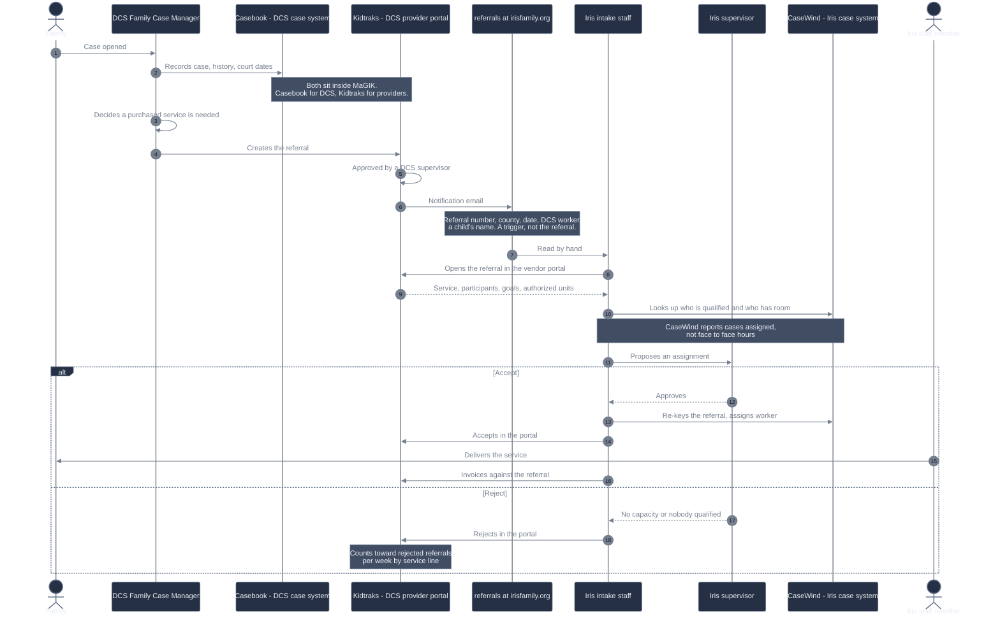
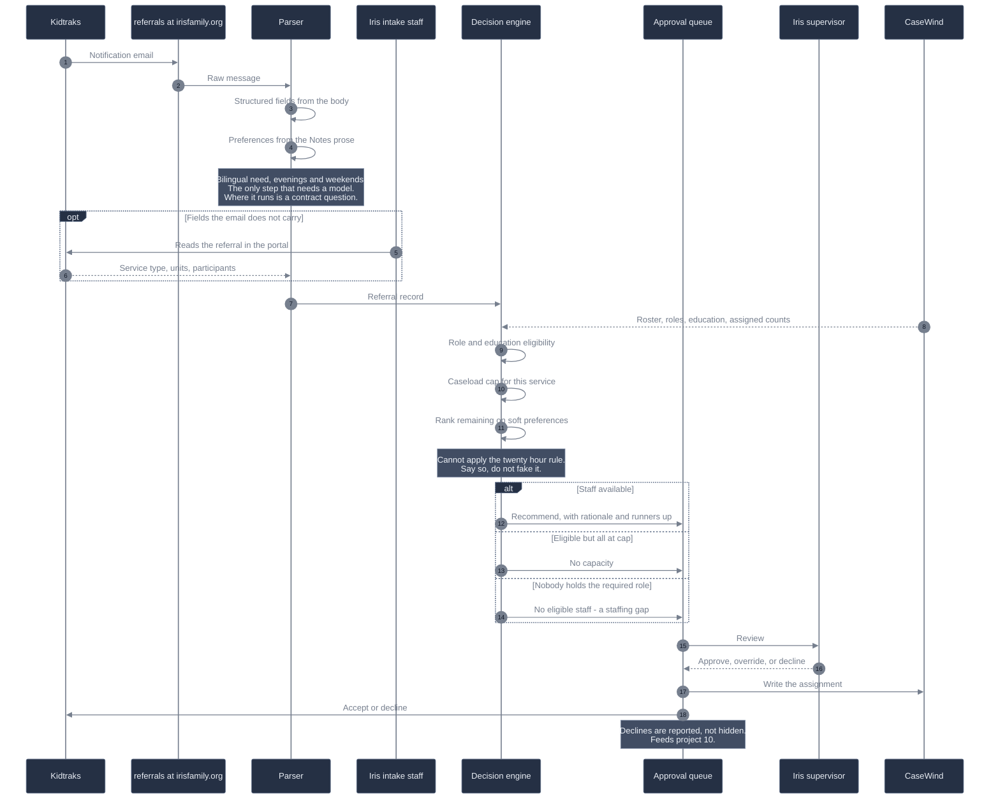

# Project 9 - who does what, and where the gap is

Two diagrams. The first is how a referral moves today. The second is what this
project inserts into it.

Read `approval_rules.md` first - it has the rules. This file has the shape.
See `deep-research-background-project.md` for the sourcing behind the claims
below.

## What is real here and what is not

- **Real:** the actors, notification by email from Kidtraks, the click-through
  into the vendor portal to review and accept or reject, the manual re-keying
  into CaseWind, the supervisor approval step, and rejected referrals being a
  KPI Iris tracks.
- **Corrected.** MaGIK is not the FCM's case system as distinct from Kidtraks.
  DCS describes MaGIK as the legacy ecosystem that contains **both** Casebook,
  the case-management interface, and Kidtraks, the provider and financial side.
- **Corrected.** "There is no API" is too strong. DCS publishes a provider
  Attachment API for monthly reports and a CSV/XML import for invoices. Both run
  provider to DCS. No public interface for **retrieving referrals** was found.
- **Corrected.** The notification email is thinner than this pack models it. The
  published sample carries the referral number as a link, county, submission
  date, the submitting DCS worker, and a child's name. Enough to trigger work,
  not enough to decide. The full referral sits behind the portal login.
- **Corrected.** Twelve families is **service-specific**, not a blanket DCS cap.
  It is published for Home-Based Casework and Home-Based Therapy. DCS has said
  the maximum depends on the individual service standard.
- **Invented:** every name, case number, and note in `referral_emails.json` -
  including the three-business-day line in the footer. The 2018 Kidtraks guide
  says 48 hours; at least one current service standard says 72. Do not hard-code
  a number.

Build Saturday against `referral_emails.json` as it stands. It gives you more
than a real notification would, which keeps the parsing exercise honest without
blocking the matcher. Just do not tell Iris the email is the whole referral.

## Today

The manual steps are 7 through 14. That is the target.

Step 8 is the one the pack glosses over. The decision cannot be made from the
email alone, because the published notification does not appear to carry the
service type - which is the single most important matching input.

## What this project builds

## What crosses each boundary

| Boundary | What moves across it |
|---|---|
| DCS case to referral | The subset of the case DCS decides a provider needs. |
| Kidtraks to inbox | Notification email. A trigger and routing metadata, including at least one child's name. |
| Kidtraks portal to Iris | The full referral - participants, goals, authorized units, safety information. Behind a login. No public read interface found. |
| Iris to Kidtraks | Attachment API for monthly reports, CSV or XML import for invoices. Both documented. Both outbound. |
| CaseWind to matcher | Roles, education, counties, families assigned. Not service hours. |
| Matcher to supervisor | A recommendation, its reasoning, and what it could not determine. |

Note the asymmetry. Iris can automate everything it sends DCS and almost nothing
it receives. That is the actual finding, and it is worth telling Iris plainly.

In this pack, `Number of Children in Home` is the only measure of case size that
arrives, so any workload estimate is built on that alone.

## The judgment calls the diagrams hide

- **County.** Every referral names one and every staff row lists the counties
  they serve, but no rule Whitney gave mentions geography. Gate or preference is
  your call. It drives most of the declines either way.
- **Insurance and Medicaid referrals.** The service matrix gates them to a
  Clinician 1. The rules call them a supervisor's judgment call with no formula.
  Both statements are real. Decide which wins and say why.
- **Soft preferences.** Bilingual and evening availability are preferences, not
  gates. Show the supervisor the tradeoff rather than resolving it silently.
- **The caseload cap is per service.** `staff_roster.csv` carries one
  `max_families_dcs` column set to 12 for everyone. That is a simplification.
  Make the cap a lookup by service now, even if every value is 12 today, so the
  real standards drop in without a rewrite.
- **Where the model runs.** The DCS provider contract and the Kidtraks access
  agreement both bar disclosing DCS information to third parties without prior
  written consent. Sending referral text to a hosted model API is a disclosure.
  Nothing here is real data, so build what you like Saturday - but keep the
  model call behind one interface so a locally hosted model is a config change,
  and say so in the handover.
